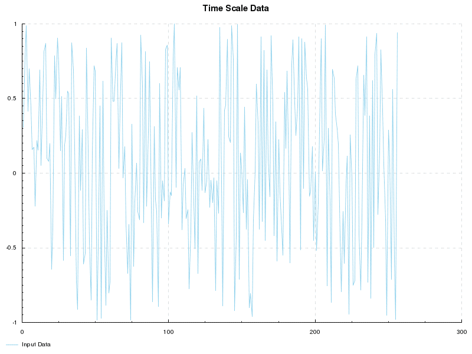

# FFT sample program

### Feature

1. Generate Random Number (-1 <= n <= 1) ... *1
1. Low/High/Band Pass and Band Stop Filtering of *1 ... *2
1. DFT of *1 and *2 ... *3
1. Drawing Chart of *1 ~ *3

### Chart

### Parameter

* Number of Data
* Cutoff Frequency(Low/High)
* Transition Band

### Filter Design

* Window Method with Hamming Window

